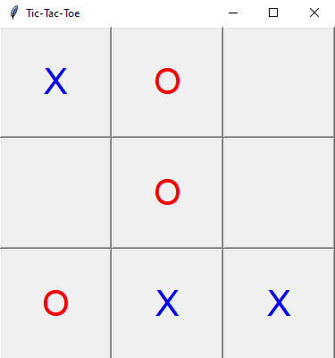

# Tic-Tac-Toe com Tkinter

Este repositório contém uma implementação do clássico jogo da velha (Tic-Tac-Toe) usando Python e a biblioteca Tkinter para a interface gráfica. Este projeto inclui uma IA básica que utiliza o algoritmo Minimax para jogar contra o usuário.

## Funcionalidades

- **Modo jogador vs IA**: O usuário joga como "X", enquanto a IA joga como "O".
- **IA inteligente**: A IA utiliza o algoritmo Minimax para calcular a melhor jogada possível.
- **Reinício automático**: O jogo reinicia automaticamente ao terminar uma partida (vitória, derrota ou empate).
- **Interface amigável**: Interface gráfica limpa e intuitiva.

## Como usar

### Pré-requisitos

Certifique-se de ter o Python instalado na sua máquina. Este projeto utiliza a biblioteca Tkinter, que geralmente já vem instalada por padrão com o Python.

### Execução

1. Clone este repositório:
   ```bash
   git clone https://github.com/isaccanedo/tictactoe-python.git
   ```

2. Navegue até o diretório do projeto:
   ```bash
   cd <diretorio-do-projeto>
   ```

3. Execute o script:
   ```bash
   python tictactoe.py
   ```

4. Uma janela será exibida com o tabuleiro do jogo da velha. Clique nos botões para jogar.

## Como funciona

- **Algoritmo Minimax**: A IA calcula todas as jogadas possíveis para determinar a melhor estratégia, maximizando sua chance de vitória e minimizando as chances do oponente.
- **Detecção de vitória**: O jogo verifica linhas, colunas e diagonais para identificar o vencedor.
- **Empate**: Caso todas as células do tabuleiro estejam preenchidas e ninguém tenha vencido, o jogo declara empate.

## Estrutura do código

O projeto é dividido nas seguintes funções principais:

- **check_winner**: Verifica se um jogador ganhou a partida.
- **is_board_full**: Verifica se o tabuleiro está cheio (empate).
- **minimax**: Implementa o algoritmo de IA para calcular a melhor jogada.
- **best_move**: Determina a melhor jogada para a IA.
- **make_move**: Lida com a jogada do jogador humano.
- **ai_move**: Executa a jogada da IA.
- **reset_game**: Reinicia o tabuleiro após o término de uma partida.

## Capturas de tela

### Interface do Jogo


